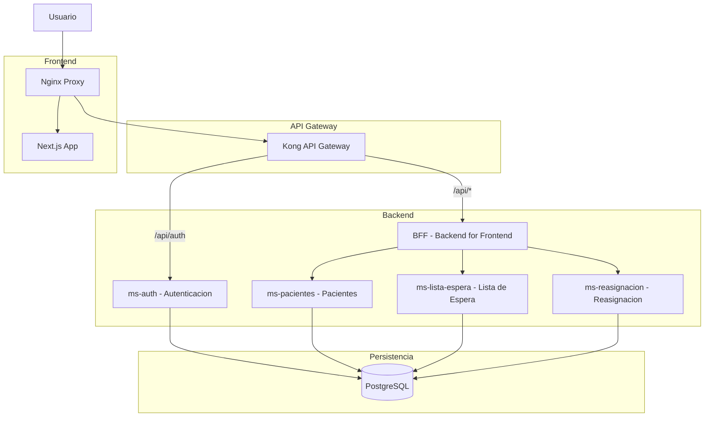

# RedNorte - Sistema de Gestion de Pacientes

Arquitectura de microservicios para la gestion de pacientes, listas de espera y reasignacion de citas medicas.

## Arquitectura



## Componentes

| Servicio | Puerto | Descripcion |
|---|---|---|
| Kong API Gateway | 8000 | Ruteo y validacion JWT |
| frontend-rednorte | 3000 | Next.js App (via Nginx) |
| bff-rednorte | 8080 | Backend for Frontend |
| ms-auth | 8084 | Autenticacion y registro |
| ms-pacientes | 8083 | CRUD de pacientes |
| ms-lista-espera | 8081 | Lista de espera |
| ms-reasignacion | 8082 | Reasignacion de citas |
| PostgreSQL | 5432 | Base de datos |

## Requisitos

- Docker y Docker Compose
- Java 17 (para desarrollo local)
- Node.js 20 (para desarrollo local)

## Ejecucion con Docker

```bash
docker-compose up -d --build
```

## Ejecucion en desarrollo

Cada microservicio se ejecuta individualmente con Maven:

```bash
cd ms-pacientes
mvn spring-boot:run -Dspring-boot.run.profiles=default
```

El frontend se ejecuta con:

```bash
cd frontend-rednorte
npm install
npm run dev
```

## Endpoints principales

| Metodo | Ruta | Descripcion | Auth |
|---|---|---|---|
| POST | /api/auth/register | Registrar usuario | No |
| POST | /api/auth/login | Iniciar sesion | No |
| GET | /api/v1/pacientes | Listar pacientes | JWT |
| POST | /api/v1/pacientes | Crear paciente | JWT |
| PUT | /api/v1/pacientes/{id} | Actualizar paciente | JWT |
| GET | /api/v1/espera | Listar espera | JWT |
| POST | /api/v1/espera | Registrar en espera | JWT |
| POST | /api/v1/reasignaciones | Ejecutar reasignacion | JWT |
| GET | /api/v1/dashboard/paciente/{id} | Dashboard paciente | JWT |

## Pruebas unitarias

```bash
# Todos los microservicios
cd ms-pacientes && mvn test
cd ms-lista-espera && mvn test
cd ms-reasignacion && mvn test
cd ms-auth && mvn test
cd bff-rednorte && mvn test
```
