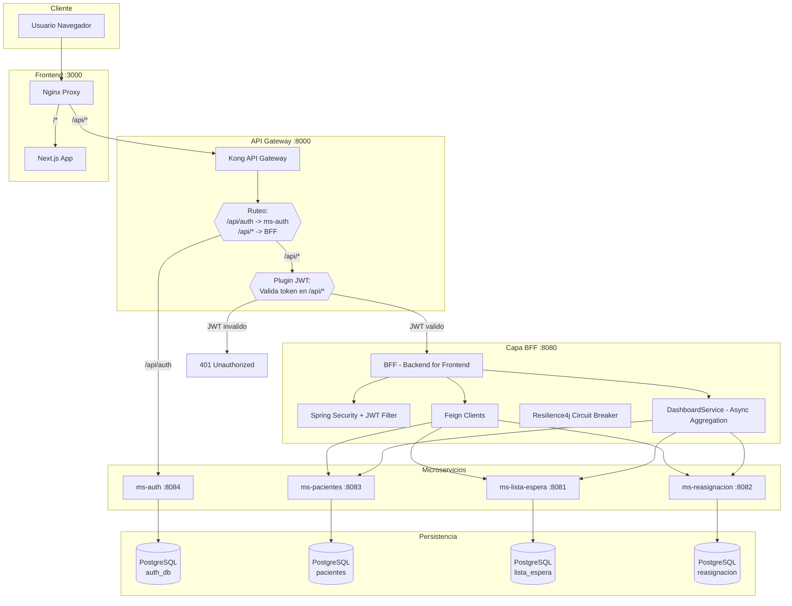
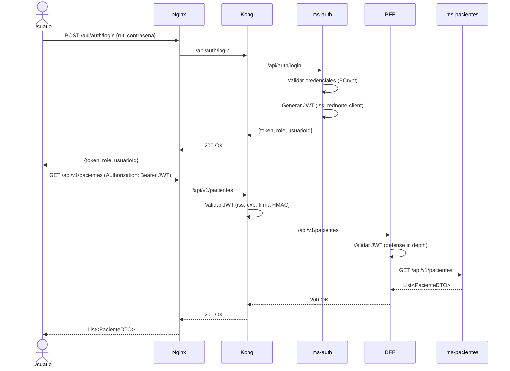
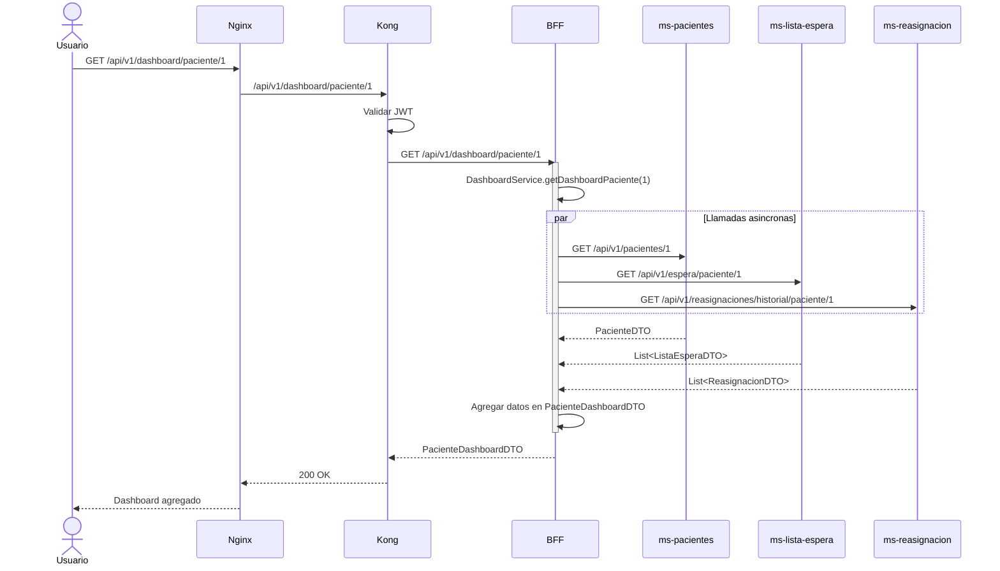

# Diagrama de Arquitectura - RedNorte

## Esquema General

## Flujo de Autenticacion

## Flujo de Dashboard

## Tecnologias

| Componente | Tecnologia | Version |
|---|---|---|
| Frontend | Next.js | 14.2 |
| API Gateway | Kong | 3.7 |
| BFF | Spring Boot | 3.2.5 |
| Microservicios | Spring Boot | 3.2.0 |
| Lenguaje | Java | 17 |
| Persistencia | Spring Data JPA / PostgreSQL | 15 |
| Autenticacion | JWT (jjwt) | 0.12.5 |
| Documentacion API | OpenAPI / Swagger | 3.0 |
| Pruebas | JUnit 5 + Mockito + JaCoCo | - |
| Contenedores | Docker + Docker Compose | - |
